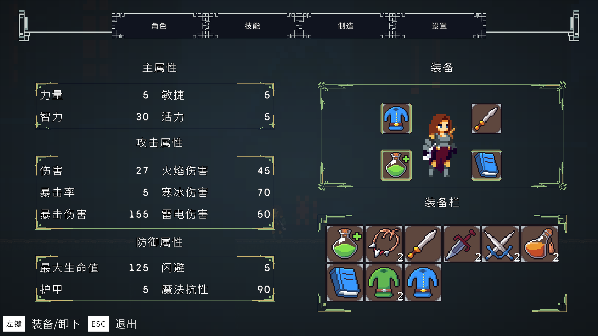
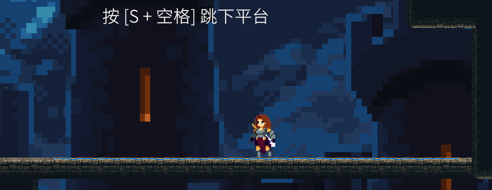
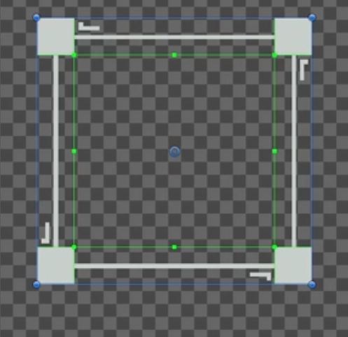

以下为制作时的一些总结,笔者表达不清请见谅

# 运行




# Entity
作为玩家和敌人的基类
Entity有**受击, 朝向, 攻击范围, 墙壁检测, 地面检测**
### 一定要注意朝向的设置
可以用一个bool和一个float来默认是右边, 然后再在各种逻辑中用这两个值判断方向, 不过是float用的多, bool的话只有翻转用到了
### 受击后的闪白特效
可以通过纯白的material来做 , 攻击后纯白, 一段时间后还原, 这个一段时间就可以用**协程做**
### 被击退方向
在击打时给出**受击打方向**来判断应该往哪边被击退

还可以根据造成伤害的百分比击退不同的距离
# 玩家
## 玩家状态机
通过状态机来对玩家的行为进行切换, 如果不使用状态机的话, 如果想要添加一个行为, 那么需要改变很多处的代码, 而使用状态机后, 我们只需要定义好该状态的进入时机和结束时机

然后在update中完成该状态需要完成的任务即可
<font color="#ff0000">Player中的Update完成当前状态机所运行状态的update和其他可打断技能的检测</font>
## 输入与可打断技能
通过Input.GetAxisRaw ("Horizontal"); 来获得左右输入, 上下同理
因为玩家随时可以冲刺与喝药, 因此需要在Player中时刻检测
## AnimationTrigger
Player脚本中定义了很多Animation的Trigger函数, 因为动画帧是作为子类放在GameObject的Player下面的, 所以很多东西调用比较麻烦, 所以在Player中给出Animation的接口, 动画帧直接调用Player中给出的函数即可
## 台阶下落
玩家通过 下 + 空格往台阶下落, 是用一个**lastPlatform来记录最后一个可下落的台阶**来完成的, 在地面状态如果 下 + 空格, 那么该台阶会**暂时关闭碰撞器0.5秒**, 这样就可以往下落

## 连续攻击
在**动画中利用ComboCounter来计数, 0,1,2各自对应相应的动画**

如果玩家在地面点击鼠标, 那么进入攻击状态, 进入状态时可以进行移动(保证操作灵活性), 当进入状态后就播放动画, 配合动画帧完成后, ComboCounter++, 再回到idle状态即可

在这里我们**通过lastTimeAttacked来完成攻击间隔的检测**, 一旦超过间隔将重新开始平a

## 落地攻击
是通过一个绑定在玩家身上的一个collider完成的 , 这个**collider要比 地面检测的长度长**, 
collider通过动画帧SetActive开启,并且一旦检测到地面或者动画帧完成**就SetActive关闭**, 这里关闭的不是collider而是这个gameobject, 也是一样的

## 攻击硬值
可以通过一个bool来进行 , Player的默认状态是idle, 所以在idle中添加一个bool的检测即可让玩家无法移动, **这个bool可以在各种需要硬直的地方进行设置**, 用携程设置会很方便
# 玩家技能 
## SkillManager
用SkillManager管理
SkillManager中挂着这些脚本, 他们的Update都是随时可用的

冷却时间函数
使用技能接口
检测最近敌人的接口
## 冷却时间
冷却时间可以用   现在时间**Time. time** 是否大于 上一次使用时间lastTime + 冷却时间coolDown, 来做, lastTime要初始化为负无穷, 或者其他解决方法也行
## 投掷剑
### 瞄准
瞄准状态, 可以在0.5秒后将玩家速度置0, 这样更平滑
**游戏开始的时候就生成很多prefab, 但是SetActive关闭**
当进入瞄准状态时, 调用这个Skill的函数打开这些prefab, 然后用一个循环把每个点的位置进行放置即可, i是连续的, 用 i × spaceBetweenDots就可以让每个点平均分布

当按键取消或发射剑时, 就关闭这些prefab就行了, 因为这个描点不是一次性的东西
### 发射剑
#### 穿刺剑
穿刺目标, 一段时间后自动销毁
#### 弹跳剑
攻击到目标后, 通过函数附近的各个敌人, 加入链表, 然后根据链表一一靠近即可
#### 铰链剑
攻击到目标后, 按照当前方向减少速度旋转几秒, 然后根据按键或者时间转完返回到玩家手中
## 防反
敌人攻击时通过动画帧打开窗口, **同时将canBeStunned设置成true**
而玩家进入防反状态时, 首先会检测是否打开窗口, 检,测到打开, 那么就播放成功格挡的动画
而敌人的**基类有能否被防反的检测接口**, 每个具体敌人<font color="#ff0000">只要实现当基类的接口 (也就是CanBeStunnedByCounterAttack) 为真的时候, 进行状态转换, 转换到Stunned状态</font>, 这个状态只需要一些特效即可完成防反

这个特效可以通过协程InvokeRepeating反复调用某个函数完成, 这个函数用一个bool就可以实现一闪一闪的效果 (为真时sprite 转red, 为假时white)

在退出状态时用CancelInvoke关闭这个协程即可

## 黑洞
在地面输入按键后, 玩家状态机**进入释放黑洞的状态**, 在状态中可以设置玩家的一些行为, 比如飞行然后停止 (rb重力为零), 停止后调用SkillManager的Blackhole技能, 这个技能会生成一个prefab, 并通过**setup函数传递一些信息给黑洞prefab**

这个prefab首先会变大, 然后如果检测到有敌人进入了这个黑洞, 那么**首先会在敌人的头顶随机生成一个按键, 而这个按键也是一个prefab, 通过SetupHotkey传递信息(传递的信息包括黑洞的控制器), 在按键的脚本中获取相应的按键Input,** 如果有input, 那么就<font color="#ff0000">将当前的按键所绑定的敌人的位置加到黑洞prefab中的链表中</font>, 黑洞中有定时器, 如果定时器结束或者按键QTE全部输入完毕, 那么就按照这个链表中的敌人开始进行攻击, 

## 水晶
在Player中检测到按键后, 确定冷却完毕, 那么就根据技能树所点的生成水晶
### 普通水晶
普通的水晶就直接生成prefab, 然后如果再次按键, 与玩家位置互换, 然后爆炸
### 跟踪水晶
用Physics2D. OverlapCircleAll找到附件的所有敌人, 然后用一个循环找到最近的敌人, 通过Setup传递给prefab, 然后prefab的往敌人方向运动, 如果距离到达一定程度, 那么爆炸


# 敌人
## 敌人状态机
通过状态机来完成敌人不同行为直接的变换,
状态机通过状态和状态的保存来完成
**初始化状态, 变更状态**
变更状态时要退出当前状态, 进入要变更的状态
具体的行为在状态内的Update给出, update在Enemy脚本中使用
为了方便, 我们在EnemyState中给出了定时器还有触发器的设置
### battle状态
只要**敌人检测到玩家 (继承Grounded状态)** 就进入battle状态
battle状态是最关键的, 首先battle时应该转向敌人, 并且当玩家死亡时, 无视玩家
如果battle状态一段时间没有检测到玩家且距离远, 则回到idle
**与玩家距离小于攻击距离则转换为攻击状态**
剩下的就是一些优化, 距离玩家近时停止移动
**玩家跳跃时随玩家转向**
检测到尽头则停止移动
在SkeletonBattleState中有详细示例
### 攻击
通过动画帧调用AnimationTrigger中的函数来造成伤害
### AnimationTrigger
这个脚本绑定到Animator上, 通过动画帧调用这个脚本, 这个脚本再调用敌人身上的一些脚本即可完成一些配合动画演出的功能
或者**配合StateMachine中的isTrigger来完成一些状态中需要进行的事, 比如死亡状态时的销毁什么的**

给敌人的攻击间隔随机化, 只需要将冷却时间进行一些随机更改就可以了

Rigidbody collider 状态, 特效, 掉落物, 行为

CollisionDetection Continuous
## 骷髅
最简单的生物, 没什么好说的

## 史莱姆
**通过enum实现大生中, 中生小**
制作大中小三种预制件, 然后**在预制件中选自己是什么种类就好了 (脚本中定义)**
在EnemySlime中生成prefab即可, 同时可以通过增加速度来模拟史莱姆死亡爆开的感觉

有需要<font color="#ff0000">非连贯性动画的时候, 可以先用bool进入状态, 然后在状态中用trigger进入不同的动画, 最后再用bool退出这个状态(可以再连接一个动画),</font>比如这里的Stunned就是用了这种方法, 通过trigger连接动画

## 弓箭手
### 箭
0重力, 碰撞检测连续CollisionDetection Continuous
**拖尾特效用particle**做, 勾选Trails 

通过层layer来进行判断造成伤害, 当<font color="#ff0000">碰撞到什么东西后就卡在上面, 也就是设置rb全Freeze和设置transform的父object的位置来卡住箭</font>
```c
rb.constraints = RigidbodyConstraints2D.FreezeAll;
transform.parent = collision.transform;
```
卡在上面后逐渐透明然后消失, 通过**调整alpha完成**
### 制作
**BlendTree, 关掉automatic threshold, 通过yVelocity控制控制跳跃和降落动画**,
射箭通过动画帧生成预制件完成, 箭的伤害通过传递stat进行计算
**后跳通过在JumpState中, 改变velocity完成**
防止后跳到虚空中, 可以添加一个Check在它后面, 当检测到没有ground的时候就不让后跳

## 自爆暗影
配合动画帧, **在举起爆炸物后创造prefab**, 然后调用Setup传递一些信息, 比如膨胀速度, 膨胀最大值, 然后自己死亡

然后的事就是prefab来做了, 膨胀爆炸什么的, 爆炸伤害也能通过动画帧来做

## Boss
pixels per unit可以调整大小

传送, **使用box collider来限定传送范围**, 随机xy后判断下方是否有地面, 然后再加上本身的cd的size/2, 就可以完美的放在地面上, 同时还要再次判断周围是否有地面, 没找到就再次调用即可

OnDrawGizmos是真好用, 用这个可以很方便的完成一些check的处理
**SomethingAroundCheck的框不能超过CapsoulCollider2D的底部**, 要不然会爆栈

设置了阶段, 在1阶段时不使用传送
在血量低于百分之60时, 进入二阶段, 此时每次攻击之后会传送,

而释放技能是在每次传送后, 判断可以释放技能在一段时间内的施法状态, 进入施法状态后, 设定状态的时间, 然后**再Update中根据施法频率生成法术prefab, 这里可以根据玩家的速度来生成, 如果玩家停止就在他身上生成, 如果玩家有速度就再他前方的位置生成**

这个技能<font color="#ff0000">通过动画帧来控制释放的那一刻造成伤害</font>

如果通过prefab来生成boss的话, 要**同时生成Boss的领域(Box Collider)**,

# 状态Stat
## 数值基类Stat
<font color="#ff0000">一个baseValue 和 modifer的链表</font>
可以完成对一些来自不同装备的效果进行相加
## 基类CharacterStats
定义各种**StatType**

各种伤害各种属性都在之类计算, 力量敏捷属性伤害什么的全都放在这里, 看起来很多其实都是一些伤害的计算, 并不难

根据计算结果是否为零, 还要有Die函数能够调用

同时也给出了**无敌效果, 用一个bool和协程实现,** 因为是在这里计算伤害, 很简单

总之要<font color="#ff0000">尽可能将有关计算的地方都使用Stat来进行</font>, 因为每个敌人或玩家都会挂载各自的Stat脚本
## 特殊效果
着火，隔段时间受伤（TakeDamage导致的平推没改）
冰冻，受伤害增加，
雷击，打出的伤害稳定性降低

这里的算法是**受哪个效果的伤害最高就生成什么效果**
## 等级提示属性效果
通过给敌人设置等级来增强敌人 (在EnemyStats中, 在初始化血条之前根据等级modify, 这里使用了一个类阶乘的算法, 挺超模的)
# 特效Fx
总之就是**用携程提供各种函数让有需要的地方调用**就可以了
其实和AudioManager一样, 只不过完成所需要的手段更难点, 要各种调整角度调整位置调整颜色什么的

修改SpriteRenderer还有material (提供纯色)
## 制作粒子效果
Effect particle system
render设置2d材质, texture sheet animation设置粒子图片, 换成sprite
emission设置粒子多少, shape控制粒子发散形状, 是以3d的形式做的, 可以换成3d模式来做, start lifetime设置存在时间
Color over lifetime设置alpha降低到0, 将Play on Awake关闭, 打开Prewarm

恩3d上其实跟棒球机一样的
## 粒子效果挂载
通过Entity挂栽相应的GameObject然后再**对应的时机让他Play就可以了**, 在我们的系统中, 刚好已经完成了根据不同的负面效果变成相应颜色的代码, 只需要在上面加上对应粒子效果的play和stop就可以了

## 给黑洞加上特效
给特效做好动画, 放到黑洞的上一层被黑洞盖住, 然后因为是**黑洞的子部件**, 所以会随着黑洞一起扩大
## 雪, 雨等效果
shape为box
设置velocity over lifetime 的 linear 的y为-1, 就会往下飘, 设置x可以往左右飘
然后将**start size**设置为很小就变成小白点了
再设置collsion, type world, mode 2d, collision with 选要碰撞的, 减小bounce, Color over lifetime设置alpha降低到0 (透明度)

可以用这种微小的粒子效果来指引玩家

## 攻击特效
造成伤害时生成prefab就可以了, 可以调整**position**和**rotation** (new Vector3) 来让攻击特效的位置随机, 并且每次击打的特效都不一致

<font color="#ff0000">在Instantiate时如果第四个参数传入一个transform, 那么就会将这个预制件绑定到这个transform上, 同步移动</font>

## 灰尘特效
用effect particle
关闭loop, 调整duration, 再调整emission, **simulation  space world (不跟随玩家)**
rotation调到0最好
## 冲刺残影特效
玩家在冲刺状态时Update**不断调用CreateAfterimage函数** (在PlayerFX中), 而这个函数内通过定时器 (afterimageCooldownTimer<0 和 afterimageCooldown) 来判断<font color="#ff0000">是否能够生成prefab</font>

同时Prefab生成后就要开始慢慢变透明, 然后消失, 因此**Prefab需要一个脚本来控制消失速度, 也就是AfterimageFX**, 这样就完成了残影的制作
## 摄像机抖动
在玩家身上添加**Cinemachine Impulse Source**脚本, 设置为0
这里再**CM vcam1**那里记得要添加listener组件不然不可以监听到抖动

在需要抖动窗口的地方调用ScreenShake 函数 (在PlayerFx中), 这个函数内部通过调<font color="#ff0000">整CinemachineImpulseSource的m_DefaultVelocity (抖动方向和强烈程度)</font> 还有GenerateImpulse来产生抖动, 同时使用一个canScreenShake的bool变量防止多次叠加的抖动
## 弹出文本
3D Texture
是的color. a是0-1，Color32. a才是0-255

作为一个**prefab在需要的地方生成即可, 生成后由自己的脚本控制自己是如何消失**
在本项目, 用一个timer来计时存在多久, tdimer结束后
通过更改透明度alpha来进行透明化, 最后消失, 
同时控制position让文字消失的时候往上飞, 很清晰

# 装备
## 物品 
我们用ItemData来抽象
然后每个物品放入一个插槽, 也就是InventorySlot, **一个插槽对应一个物品还有他的总量**
inventorySlotList就是已有装备列表, inventorySlotDictionary就是计数, 
## 更新物品 (更新UI)
在<font color="#ff0000">增删物品时对UI进行更改</font>, <font color="#ff0000">先清除再重绘即可达到换装效果</font>
通过Stat中设置的modifer接口可以让装备能够更改角色属性, 每个属性我们通过Stat来计算
## 制作物品
要删除材料, 因此有一个**临时链表来存储要删除的材料**, 如果需要同一个材料需要多个, 还可以改成pair的形式.  先检测需要的物品, 放入链表, 检测完后, 根据链表从已有物品中进行删除 (有了接口之后就都很好写)
## 掉落物
掉落物只与地面碰撞, <font color="#ff0000">rb和collider放外面 (与地面碰撞, Item层), 里面再放一个collider trigger (与玩家碰撞, 默认层)</font>

掉落物绑定在Enemy身上, **死亡时调用相关的脚本就好 (生成预制件)**, 这里可以给每个敌人设定每个物品掉落的概率, 可以在Enemy上定义掉落物概率的接口. 
不过这里实现的是每个物品固定掉落的概率 (Data是数据, Object是掉落时的形式, Slot是背包中的形式)

玩家死亡掉落也一样, 死亡后掉落装备或材料, 这个也是设置难度的一种, 简单的循环就可以解决, 只不过要注意移除物品时的操作
## 装备效果
给装备加上特殊效果, 用**ItemEffect(继承ScriptableObject)接口**, 我们首先做出ItemEffect, 然后在<font color="#ff0000">ItemData_Equipment中定义ItemEffect数组, 在玩家攻击时触发ItemEffect即可</font>, 通过Inventory单例来获取当前装备 (当然也可以在玩家攻击时传递敌人位置, 然后由Inventory来处理位置信息, 然后调用相应的ItemEffect生成对应的prefeb, 然后产生效果)

当定义好ItemEffect后, 不管增加什么效果都是很简单的事 (增加ItemEffect固件 <font color="#ff0000">[CreateAssetMenu (fileName = "Heal Effect", menuName = "Data/Item Effect/Heal Effect")] </font>, 新建装备, 在装备中增加ItemEffect就可以了 <font color="#ff0000">public ItemEffect[] itemEffects;</font> ), 可见做一个逻辑自洽的系统是多么重要
## buff效果
用 IEnumerator 和 StartCoroutine的协程给player上buff, 从CharacterStats中获取buff类型, 然后给出持续时间和buff值即可, 这里的buff是当作itemEffect来做的, 也可以分开
## 其他
装备有限插槽
材料无限插槽

Inventory管理总的所有物
有三种
	材料
	可装备物品
	已装备物品
	
注意代码的联动性, **装备带来的属性也要在取消装备的同时消除掉**, 就跟指针的消除一样
# UI, 游戏内的
## UI血条
Slider，Background修改，
Canvas大小修改，World Space，玩家层
Fill rect 控制血条

Canvas belike: 

**onenable在awake后, start前运行**

<font color="#ff0000">通过委托来管理血条</font>
**public System. Action onHealthChanged;(CharacterStats中定义)**

然后playerStats. onHealthChanged += UpdateHPUI; 即可在每次调用onHealthChanged的时候**自动调用UpdateHPUI了**, 这样血条就可以自动更改
## 菜单UI
在Canvas下创建菜单
### 背景
Create Empty, 加上image, 调整在中间位置, 同时调整透明度 (这只是一个页面的)
### 头部选项
再Create Empty, 调整位置, 加上image, grid layout (child alignment: middle center, cell size, Spacing)
创建button, 调整image和text即可
### 内容
ui-image + ui-text , 只会拉伸绿色框中的内容, 可以用XY坐标来对齐
### 属性
两个ui-text, 一个左对齐一个右对齐, 子要跟父同拉伸  (设置Raycast Target为空即可以取消它的点击框, image中)

创建UI脚本, 放到Canvas上, 把每个按钮的onClick加上脚本


更改菜单在这里实现的是先全部关闭再打开的, 在打开时再按下会关闭
## 物品的描述
用 **(依旧是image + text)** 脚本控制, 可以在UI中获取子控件, 从而获取脚本,
界面可以用content size, 和vertical layout来控制, 这样可以随着文本大小而变换展示框大小

描述有, 名字, 类型, 属性, 当鼠标移动到Slot时, 展示描述, 因此在<font color="#ff0000">InventorySlot_UI中调用ShowToolTip.</font>
名字, 类型, 属性, 都是控件, **从InventorySlot_UI中获取相应的装备**, 从而获取对应的信息, 理清这个逻辑后, 剩下的就是调整前端界面了

要注意,<font color="#ff0000"> 所有的界面都是由UI来控制</font>的, 其他的小部件都是通过调用UI或者Inventory来获取所需要的信息, 或者展现出新的UI的

对于那些不知道有要展现多少条数据的Text来说, 我们可以使用StringBuilder, 在脚本中检测是否有这个属性, 如果有, 则StringBuilder加入这条语句,  <font color="#ff0000">sb. Append ($"[unique effect]\n{itemEffects[i]. effectDescription}\n"); </font>最后将StringBuilder转成String即可, 挺简单

由于由多个Tip, 而且每个Tip的出现位置都是相对鼠标的, 所以建立了一个UI_ToolTip?

**取消BlockRacasts**让鼠标可以**透过某个界面进行点击**, 比如说Tip界面 
## 制作页面
**Scroll View**, 在content中使用某个layout后, 再添加多个元素, 我们就可以实现滑动查看了 (可以关闭horizontal)
content控制能够滚动到哪, 加入content size fitter后就可以自动更改content的大小了, 想怎么滚久怎么滚

每个制作物肯定由不同的 名字, 描述, 图标, 还有材料, 这种就需要脚本来控制,
**做UI之前就要想清楚要展示些什么, 每一个图标每一个文字GameObject, 然后我们就能够用SerializeField来获取这些元素, 再用脚本来进行控制CraftWindow_UI 和CraftList_UI都是这样控制的**

其中CraftWindow_UI是根据CraftList_UI中的CraftSlot_UI来控制展示的, 实际上就是<font color="#ff0000">一个装备的展示窗口,</font> 因此由一个UI单独控制, 因此CraftWindow_UI有这么多的SerializeField

而CraftList_UI则是通过四个类型来分别控制四种类型的展示, <font color="#ff0000">因为每个列表有很多装备</font>, 因此有四个类似按钮的东西来控制四个列表的刷新与展示, 不过本质上都是一样的, 只是实现方式略有不同 ()
而刷新的话, 基本就是靠**清除重绘**来实现, 比如CraftList_UI就是先销毁再重新创建相应的CraftList_UI
  
## 技能树
怎么做UI就不说了
主要是这里运用了shouldBeUnlocked和shouldBeLocked来模拟<font color="#ff0000">是否能够解锁该技能 </font>(哪些已解锁, 哪些被解锁 (选择性))
其他的Slot控制Tip输出和上面的内容差不多, 稍微做一下前端就可以了

技能解锁, 在**Skill中绑定SkillSlot的点击事件**, 点击后将Skill解锁, 例如 `dashUnlockButton. GetComponent<Button>()?.onClick.AddListener (UnlockDash);`, 同时还要再SkillManager中进行SkillSlot的绑定

注意再<font color="#ff0000">UI的awake</font>要有<font color="#ff0000">skillTree_UI. SetActive (true)</font>; 要不然无法正确学习技能, 因为Onclick的先后执行顺序问题
(是技能树的功能, 首先点击技能槽, 技能槽会在OnPointerEnter中执行一些逻辑, 比如前置技能是否已经学习完毕之类的, 然后设置这个技能槽已经学习, Button中的bool unlocked会被设为true, 然后UnlockCloneOnDashEnd就是检测这个unlocker是否已经设为true, 如果为true, 那么久可以设置这个技能的Unlocker为true,)
## 游戏内UI
### 冷却条
两个图片, **子图片选用filled**
<font color="#ff0000">脚本中获取子图片</font>, 然后就可以 `_skillImage. fillAmount -= (1 / _cooldown) * Time. deltaTime;` 展示冷却时间的情况了
教程里是把每个技能的展示框分别进行了制作, 最好还是用做一个CooldownSlot来统一管理比较好

把文字放到技能框下面然后弄成不透明也行
ToString ("#,#") 就可以自动将数字转换成11,451,411了
## 设置界面
Slide就可以制作一个滑动设置的玩意
toggle就可以制作一个选项, 用背景即可, 加上onValueChanged  就可以实现切换
## 类似黑魂卢恩的UI
其实就是在Update的时候让**数字增长随时间变换**, 还可以加上变化字体大小的效果, 更加美观, 由InGame_UI控制
```c
if (currencyAmount < PlayerManager.instance.GetCurrentCurrency())
{
    IncraseCurrencyFontSize();
    currencyAmount += Time.deltaTime * increaseRate;
}
else
{
    currencyAmount = PlayerManager.instance.GetCurrentCurrency();
    DecreaseCurrencyFontSizeToDefault();
}
```
## 回收卢恩系统
需要<font color="#ff0000">玩家死亡的位置, X, Y, 还有掉落的卢恩数</font>
**因此在GameData中要有这三种变量**

<font color="#ff0000">由GameManager管理</font>, 因为角色一旦死亡, 就无法从Player和UI上面进行一些操作, 所以这些操作都由GameManager进行, 包括检查点也是, 其实Inventory呢? 应该也是可行的, 是可以把各种Manager都放到GameManager的, 但这样就过于庞大了, 而且我们一开始就是用Inventory来管理玩家的库存的.

如果身上有了卢恩才生成预制件, 恩跟法环一样, 舒服
**玩家身上有多少卢恩是通过PlayerManager来管理的, 只要在死亡的时候进行更改即可**
敌人身上**掉多少卢恩通过EnemyStats直接加在PlayerManager上**, 然后InGame_UI就可以根据差值进行数值的更改

# 保存系统
## SaveManager实现原理
SaveManager通过<font color="#ff0000">ISaveManager接口</font>寻找所有要保存的内容, 然后保存为GameData, 序列化成文本

SaveManager单例
它的GameObject通过**Start和OnApplicationQuit**来加载和存储游戏, GameData中放的就是所有要保存的内容

通过下面的代码就可以找到项目中<font color="#ff0000">每一个继承了IGameProgressionSaveManager</font>的代码, 然后就可以读取他们要保存的信息
```c
private List<IGameProgressionSaveManager> FindAllGameProgressionSaveManagers()
{
    IEnumerable<IGameProgressionSaveManager> saveManagers = FindObjectsOfType<MonoBehaviour>().OfType<IGameProgressionSaveManager>();

    //new List<ISaveManager>() here is just a constructor
    return new List<IGameProgressionSaveManager>(saveManagers); 
}
```
通过FileDataHandler就可以将GameData序列化为json 然后保存为文件, 或者读取文件从json转换为GameData,
## 存储装备
我们需要同时存储装备名和数量, 装备名可以用ID来代替, 这样就要用到字典
在ItemData中使用下面的代码即可给<font color="#ff0000">每个物品生成一个ID</font>

```c
    private void OnValidate()
    {
#if UNITY_EDITOR  //meaning the code inside this # (macro) will only be executed in unity editor, and won't be compiled when building the game
        string path = AssetDatabase.GetAssetPath(this);
        itemID = AssetDatabase.AssetPathToGUID(path);  //GUID means global unique identifier for the asset
#endif
    }
```

而<font color="#ff0000">存储字典</font>时, 我们需要自己创建一个SerializableDictionary, 这个类继承字典, 然后将字典转换成两个链表

在存储装备时, 用到了**loadedInventorySlots链表来读取保存在序列化的json中的数据**, 这里用了简单的二重循环来查找装备是否存在, 这里用了数据库来获取所有装备, 用来遍历,
那么怎么获得数据库呢?

通过 `AssetDatabase` 工具，在编辑器模式下从路径 `"Assets/ItemData/Items"` 中查找所有 `ItemData` 类型的 ScriptableObject 资源，并将它们加载到一个 `List<ItemData>` 中，形成一个“数据库”（即内存中的数据集合
[[获取数据库]]

SavaData的时候要记得先**清空再存储**
## 保存技能树
因为<font color="#ff0000">每个技能都有以一个Slot脚本</font>, 所以Sava的时候要注意 (先检测是否存在, 存在则删除重新放入)
## 在Unity中建立删除存档方法
只需要在FileDataHandler中建立删除的方法就可以了, 然后用ContextMenu在脚本上给出相应的选项
```c
[ContextMenu("Delete game progression save file")]
public void DeleteGameProgressionSavedData()
{
    gameDataHandler = new FileDataHandler(Application.persistentDataPath, gameFileName, encryptData);
    gameDataHandler.DeleteSave();
}

```
## 给文件内容加密
这样**异或**就可以了, codeWord可以是任意字符串, 如果加密了, 那么保存和加载都要使用EncryptAndDecrypt
```c
private string EncryptAndDecrypt(string _data)
{
    string result = "";

    for (int i = 0; i < _data.Length; i++)
    {
        // ^ means XOR, 异或
        result += (char)(_data[i] ^ codeWord[i % codeWord.Length]);
    }

    return result;
}
```
# 游戏开始界面
把SaveManager做成预制件,
File BulidSetting, <font color="#ff0000">让MainMenu先加载</font>
Canvas要取消RaycastTarget

**Unity已经给出了SceneManager, 只需要LoadScene加名字即可转到另一个场景**, 新游戏的化先删除存档再开始即可, 同时也可以制作多个存档位, 怪不得小游戏一般只有少量存档位

没有存档的时候, 要隐藏Continue, 可以在<font color="#ff0000">SaveManager中给出是否有存档的接口</font>(SaveManager管理存档), MainMenu_UI在Start时检测然后设置SetActive就可以了
## 渐入渐出
渐入渐出的功能可以利用动画来完成, **录制:首帧全黑不透明, 尾帧全黑透明即可, 要把这个BlackScreen放到Canvas的最下面, 还要把RaycastTarget关了**

因为我们是在UI脚本中<font color="#ff0000">通过循环检测Canvas下的所有UI来更改UI的</font>, 而现在我们把BlackScreen也放到了Canvas下, 但BlackScreen需要保存Active, 所以在Switch处对BlackScreen进行了特殊处理, **让他不参与UI的变更**

用Trigger就可以轻松的调用淡入淡出, 不要忘记关掉loop
## 死亡界面
文字也可以像这样淡入淡出, 只需要在脚本上加上相应的控件, 然后对文字进行控制, 再配合黑屏的渐入即可

重新开始作为一个<font color="#ff0000">button, Onclick要绑定Canvas,</font> 然后通过Canvas的UI脚本来对Canvas现在所展现的场景进行切换 (这里是UI脚本是用了GameManager定义的重启游戏的接口)

**同时重新开始后死亡界面的内容应该要关闭,** 因为严格来说这并不是一个像库存UI那样的UI, 所以我们需要获取button控件和文字控件将他们设置为**Active (false)** 

# 检查点
我们将检查点放到GameManager (**GameManager也需要一个GameObjcet来挂载)** 中, 并且将<font color="#ff0000">最后一次使用的检查点也用一个变量保存</font>, 利用一些循环将Load和Save写好就可以了, 总体还是用检查点的ID

这里因为检查点很少, 所以就直接<font color="#ff0000">手动生成ID</font>了, 检查点需要有动画, ID, 激活状态

```c

[ContextMenu("Generate checkpoint ID")]
private void GenerateCheckpointID()
{
    checkpointID = System.Guid.NewGuid().ToString();
}
```


# 其他
## IEnumerator, yield return, StartCoroutine (协程)
启动协程,<font color="#ff0000"> 但不是多线程</font>, 只是按帧 暂停-恢复 来模拟异步
如果有加载顺序的错误, 可以利用协程将加载放到起冲突的地方的后面执行
## Invoke
可以当作简化版的协程来使用, 一次控制一个函数
## 游戏暂停
将<font color="#ff0000">Time. timeScale设置为0就可以暂停</font>, 恢复为1可以解除暂停, 在GameManager确定
在UI的Switch函数中设置, 如果不是InGame界面的话就直接调用GameManager中的暂停函数
同时在**Player的Update中设置Time. timeScale为0**则返回, 这样停止Player检测输入

注意这里这么设置会让fadescreen也会受到暂停的影响，解决方法是在FadeScreen的Animator组件里把Update Mode选成Unscaled Time
## 死亡区域
做一个**Collider**然后调用死亡函数即可
## 素材调整
素材: Multiple, Compression None, Fitter Mode No fitter, Pixels Per Unit, slice 素材调大小

图片大小不一样的素材可以试着更改pivot放到相同的位置

不是一定只有一个Canvas的, 把FadeScreen单独拿出来做一个Canvas也可以
# 声音系统
用AudioManager管理所有声音, BGM和音效
BGM一次只能放一个, 所以这里用的是循环关闭再开启, 和之前的游戏内UI(设置之类的)那里一样
音效就直接根据下标播放, 或者停止播放

取消Play On Awake
通过pitch就可以让每次的声音都不一样
在各种需要放音效的地方放一个<font color="#ff0000">AudioManager.instance.PlaySFX (2, player. transform);</font> 就可以了

让玩家作为音源, 其他的声音根据与玩家的距离衰减, 好像没有做到

某些声音如脚步声可以让它循环, 勾上loop就可以了, 配合moveState的Enter和Exit
## 调整音量
AudioMixer可以调整音量, 在UI上加入控制音量脚本, 然后Slider的OnValueChange绑定脚本中定义的函数即可

保存和载入在UI中实现, 使用一个<font color="#ff0000">链表</font>获取到音量GameObject, 然后再DataSetting中加入相关的数据, 比如<font color="#ff0000">字典</font>, 就可以保存了
再载入的时候, 由于使用的是链表, 所以需要<font color="#ff0000">一次遍历字典, 一次遍历链表</font>, 确定对应的数据到底是哪个, 然后进行加载

为了防止音量值变成负数, 可以将**最小值改成0.01**

可以将声音限制在开始**游戏后一秒**才播放, 这样方便将代码统一使用, 比如切换UI, 在**游戏开始的时候会切换到In_GameUI, 会播放一次音效**, 很奇怪, 但只要延迟一秒才能播放就能解决这个问题
## 环境音
可以用一个**boxCollider**来做, 就是出入时的渐变可能有点棘手
可以把Coroutine放到AreaSound脚本中, 当离开box的时候就使用StartCoroutine调用减少音量的函数即可 (缓慢降低环境音)
# 语言系统
用localeID来定义是英文还是中文, 0英文, 1中文

然后用**字典**把英文和它对应的中文放在一起, 调用的时候只需要判断<font color="#ff0000">LanguageManager. instance. localeID,</font> 就行了

不过这样不利于多语言, 多语言的话还是要用String Table Collection
# 按键绑定系统
KeyBindManager中**定义字典**让名字与按键对应, 在切换<font color="#ff0000">到相应的UI时, 通过KeyBindManager拿到所有的绑定按键</font>, 然后生成prefab, 放到一个List的UI中

更改绑定键就在prefab里完成, 通过**prefab的Controller控制,** 等待输入后再利用KeyBindManager的**字典更新按键**即可, 再通过拖入Text控制文本及时更新按键即可, 保存的时候退出时会自动保存的
# TilePalette, 地面背景等
create new palette, **把asset拖进tileSet中**, 然后保存
点击edit可以编辑TileSet里的
## Ground
2D, TileMap, Rectangular, 设置Layer, 添加TilemapCollider, useByComposite
添加Composite collider, 设置为polygons
rigidbody设置为static
## BackGround
**2D, TileMap, Rectangular,** 设置sortting layer,然后开始拖到场景就可以了
# 设置Camera
**cinematic studio**
**cinemachine 2dCamera**
**把玩家拖到Follow,** body 设为 framing transposer, aim: do nothing
设置deadZone范围内摄像机不会移动
# 设置无限背景图片
设置sorting layer
复制两份放到左右两边, 作为子GameObejct

在脚本中, 获取到主摄像机, 背景图当前的位置, 背景图的长度

**背景缓慢跟随摄像机(parallaxEffect)**, 一旦<font color="#ff0000">摄像机位置超出背景图, 那么背景图的位置立刻进行更新</font>, 这样就能够实现无限的背景图

```c

    private void Start()
    {
        cam = GameObject.Find("Main Camera");

        xPosition = transform.position.x;
        length = GetComponent<SpriteRenderer>().bounds.size.x;
    }

    private void Update()
    {
        float BGPositionOffset = cam.transform.position.x * (1 - parallaxEffect);
        float distanceToMove = cam.transform.position.x * parallaxEffect;

        transform.position = new Vector3(xPosition + distanceToMove, transform.position.y);

        //make endless background image
        if (BGPositionOffset > xPosition + length)
        {
            //if BGPositionOffset > background_length
            //(xPosition + length = coordinate(坐标) of the right edge of the original BG),
            //move BG to the new position
            xPosition += length;
        }
        else if (BGPositionOffset < xPosition - length)
        {
            //same as above but move BG to the left position
            xPosition -= length;
        }
    }
}

```

# 构建游戏
AssetDatabase只有在Unity编辑的时候可以使用, 因此要在前加上 `#ifUNITY_EDIRY` 后面加上 `#endif`

设置Cursor
format rgb32, override for windows, Alpha is Transparent
compression fomat disable
